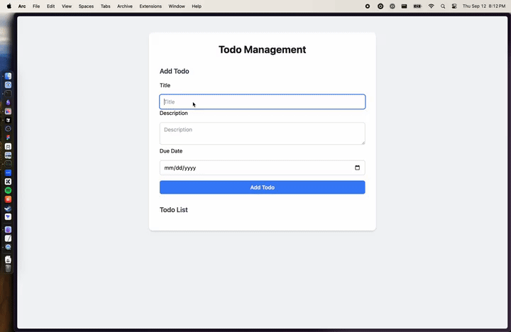

# Demo Hono + HTMX + SQLite Stack

This project demonstrates a simple setup for a web application using Hono.js, HTMX, and SQLite.

In spite of the title, I actually ended up using Bun instead of Node, and I think I like it!

Lives at: https://demo-htmx-nodejs.fly.dev/
- Scales to 0, may take a second to wake up. Requires login.


## Demo




## Philosophy

Mental model for picking this or any stack:
1. Do you have VERY long-running CPU-bound or GPU-bound processes?
   - No? A simple, single lightweight CRUD server works for this.
   - Yes? You probably need both a web server and a heavier-duty worker machine with some kind of queue or serverless process to run your long-running processes.
   - If you just have things like needing to send an email, node and bun both have great async/multiprocessing libraries to handle this.
      - Using Bun, you can do Bun.spawn() natively to run that in a separate process. Then, maybe save any failures to the db to retry.
2. Generally I would recommend Postgres for most database needs.
   - If you don't need RLS (row level security) or other Postgres features, then SQLite is a lightweight, partially file-based database engine that can also work well and so we used it here.
   - Traditionally, SQLite isn't picked for this but it's become more common and popular. You'll have generally better community support with Postgres and more features, but might get better latency with SQLite, and it would be simpler to administer.
   - Will SQLite scale? That was my big concern. It seems that the reason is that programs used to not handle concurrent writes, but that's not the case for apps today apparently.
      - See this article for more info: https://blog.wesleyac.com/posts/consider-sqlite
      - More technical on the WAL mode for journalling here, which we are using: https://fly.io/blog/sqlite-internals-wal/
3. You probably don't need an ORM
   - SQL isn't that hard to learn
   - You will very likely end up "ejecting" into SQL at some point using any ORM, increasing complexity.
   - ORMs don't save that much time, and many don't have built in migration tools, so you'd need to pick extra tools regardless, which may or may not work with your ORM.
   - You will have to re-represent your schema in both the ORM and in SQL anyway, most of the time. Doubling your work.
   - ORMs have lots of unique edge-cases and bugs you're taking on if you choose to pick an ORM.
   - That said, if you plan on changing you database in the future, you have very complex and dynamic queries, or you're just really not comfortable with SQL, maybe use an ORM.
   - It can also be a good idea to use an ORM if you are in a fullstack framework like Rails or Django, where ejecting from the ORM defeats the point of the framework.
4. Will you have lots of user-uploaded files?
   - If yes, setup Fly.io Tigris Storage for storage.
      - If you're not using Fly.io, then you might consider GCS, S3, or R2 for storage. R2 is the cheapest.
      - I'd recommend using s3fs to mount an S3 bucket on the file system if you need to access the files on your server, otherwise you can use AWS SDK to create signed urls for your files.
   - If no, then use a local volume which can either persist or not. For this project, we're using a SQLite database in a Fly Data Volume that persists across deployments.
5. Consider relying on an external auth provider.
   - This definitely saves you time when integrating with Google Auth, etc. Auth0 is a popular choice
      - https://auth0.com/docs/quickstart/webapp/express/interactive (this is for Express, not Hono)
      - This was super easy to setup and worked well.
   - If you're in a B2B setting, integrate WorkOS or Auth0 to get SSO for free, practically.
   - Otherwise, use SHA-256 and a secret to store passwords.
6. You might not need React.
   - Do you have a lot of complex UI interactions? Nested forms, lots of drag-and-drop, multiple users interacting with one page, timelines or workflows that move dynamically? If not — consider avoiding React.
   - As an alternative, check out HTMX w/ a templating engine (that's what I used here) or something like Phoenix Liveview in Elixir
7. Try tailwind for CSS.
   - Tailwind's utility classes small size and only packages what you need to the client. Easy to eject to plain CSS.
   - Avoids CSS-in-JS, which is trendy but can increase bundle size in a way that hurts performance and is harder to work with due to lack of flexibility when editing, i.e., it's harder to eject from.
8. Setup proper logging and tracing, plus encryption of environment variables.
   - Opentelemetry is a good choice for this as it's compatible with many logging and tracing providers.
   - I added Pino for the formatter for http requests: https://github.com/pinojs/pino
   - Fly has grafana built in so you can see the traces in the dashboard, which is nice.
   - Dotenvx is a good choice for environment variable encryption so you can pass those around more securely and easily.
9. Setup CI/CD
   - This project uses Github Actions for CD. I don't have experience with other systems.
   - Since there is no testing, there's no CI right now, but it's best practice to add that.
10. Go fast
   - Pick technologies that will run at low-latency and reduced memory requirements.
   - Use proper database indexing and best-practices to optimize datareturn speed.
   - With this stack and well-optimized queries, the application is responding in single ms.
   - This setup optimizes memory and response in part by compiling the JS to a single file and running that in Bun, then because it's all compiled we can use a small docker image like alpine.
11. Handle errors as values
   - This is a good idea from Rust and other more functional languages.
   - It forces you to handle all possible errors and makes them more obvious.
   - In JS, this often means wrapping the function in try/catch and returning the error in a helper as a result type.
   - Then, in the imperitive shell of the function, you can just do a simple if (result[1]) { return result[1] } to return the error.


### Things I didn't look into but might be useful:

- A build system for frontend assets. Started to look into Vite but seemed like overkill at this stage.
- https://fly.io/docs/litefs/ - for distributing SQLite databases across multiple machines. Again, overkill right now.
- https://litestream.io/guides/docker/ This would be a good first step for backups, and a stepping stone on the journey to litefs.
- Testing framework? Didn't bother setting up tests for this. Bun comes with bun:test, probably use that.
- Typescript

## Going faster

### Bun vs Node

Bun is supposed to be faster alternative to Node.js for running JavaScript.

I originally set this up with NodeJS but then switched to bun, for fun.

I didn't notice a HUGE difference, maybe it was a little faster. But, the app is responding in single ms anyway so there's not much room for improvement.

I did like that there's a package manager built in, and bun:sqlite is nice too.

Finally, it's really nice that Bun comes with a built in command line tool for running jobs. Great for debugging and also I use it to schedule the database optimization cron job.

### Even faster rendering

I switched from EJS to Eta for templating.

I'm not sure if I saw a difference, but I don't think that templating is the bottleneck at this point anyway. More of a "might as well" optimization.

[Benchmark](https://rawcdn.githack.com/eta-dev/eta/main/browser-tests/benchmark.html)

Then, for the same reason of hypothetical performance improvement, I switched from Express to Hono JS.

This added a significant amount of complexity on auth and observability since Auth0 doesn't have a pre-built library for Hono, and the library also doesn't have a pre-built open telemetry integration.

However, this NOTICEDLY decreased the response times (perhaps in conjunction with the switch to Eta), reducing the average ms time by ~70%.

This was the single biggest decrease in response time I could get, going from an average response time of 15ms to 5ms with a p99 of 24.5ms in both cases.

## Prerequisites

- bun: https://bun.sh/

## Getting Started

Follow these steps to set up and run the project:

1. ~Use the correct Nodejs version:~ (don't need this with bun!)
   ```
   ~~nvm use~~
   ```
   ~~This will use the Node.js version specified in the `.nvmrc` file.~~

2. Install dependencies:
   ```
   bun install
   ```
   This will install all the necessary packages defined in `package.json`.
3. Add the database url to .env and run the migrations
   See `Setup environment variables` below for the database url format and further instructions.
   ```
   echo "DATABASE_URL=mydb.sqlite" >> .env.*
   dbmate up
   ```
4. Start the dev server
   ```
   bun run dev
   ```
5. Copy the pre-commit hook to the .git/hooks directory
   ```
   bun run prepare
   ```

## Setup environment variables

After running `bun install`, run this to setup the private key for the environment variables:

Delete the current values and public key in .env.local and .env.production and add your own for each key.

Then, run:

```
dotenvx encrypt -f .env.production
```

```
dotenvx encrypt -f .env.local
```

These .env files are used to store the environment variables for the application.

They ARE supposed to be committed to the repository. Then, they can be used in CI/CD.

## Project Structure

- `index.js`: Main entry point for the application
- `package.json`: Defines project dependencies and scripts
- `Dockerfile`: Contains instructions for building a Docker image of the application
- `db/schema.sql`: Contains the schema for the database
- `db/migrations/`: Contains the migrations for the database
- `fly.toml`: Contains the configuration for the Fly.io platform

### Migrations

Migrations are handled with [dbmate](https://github.com/amacneil/dbmate).

To create a new migration, run:
```
dbmate -d mydb.sqlite new
```

### Docker

To build the Docker image, run:
```
docker build -t demo-htmx-nodejs .
```

I recommend using https://orbstack.dev/download to build or run the container locally on Mac Silicon, if needed.

You can also run the container locally against https with this if you want:
https://docs.orbstack.dev/features/https

### Deploying to Fly.io

Install the Fly CLI and run the following commands:

```
fly auth login
fly launch
```

It will yell at you to create a fly volume for the database, follow its instructions.

Set your fly secret environment variables from the .env.keys file.

```
flyctl secrets set DOTENV_PRIVATE_KEY_PRODUCTION='...'
```

and to deploy changes:

```
bun build-linux && fly deploy
```
or just run
```
bun run deploy
```

## Technologies Used

- [Bun](https://bun.sh/): Fast JavaScript runtime.
- ~[Express.js](https://expressjs.com/): Web application framework.~ (replaced with Hono)
- [HTMX](https://htmx.org/): Lightweight library for AJAX, CSS Transitions, and WebSockets
- [SQLite](https://www.sqlite.org/): Lightweight, serverless database engine
- ~[EJS](https://ejs.co/): Templating engine for rendering HTML~
- [Eta](https://eta.js.org/): Templating engine for rendering HTML, faster than EJS
- [Dbmate](https://github.com/amacneil/dbmate): Database migration tool
- [autoAnimate](https://auto-animate.formkit.com/): Animation library for animating the htmx changes
- [Tailwind](https://tailwindcss.com/): CSS library
- [OpenTelemetry](https://opentelemetry.io/): Open source observability framework
- [Hono](https://hono.dev/): Fast and flexible web framework
- [Magic Regex](https://regexp.dev/guide/usage): Magic Regex for matching paths. Typesafe, compiled at build time.

Database backups are right now handled by Fly.io Volume 5-day snapshots - https://fly.io/docs/volumes/overview/

This isn't recommended for long-term use, a different backup strategy should be used.

## Development

To start the server, run:
```
bun run dev
```

### Making changes

To make changes to the database, first make a migration:
```
dbmate new {name}
```

Then make the changes to the schema in the generated file.

Then,  run the migrations:
```
bun run db:migrate
```

They should be automatically applied upon deployment.

Other stuff:
- index.js is the entrypoint for the application. It's a standard Express.js app. Edit business logic there.
- src/instrumentation.js is used to instrument the app with opentelemetry. You probably don't need to change this.
- src/queries.js is a convenience wrapper around the database for interacting with the database.
- views/* contains the html templates. These are rendered with EJS on the server. HTMX is used to update the DOM, check the hx-* attributes.
- public/* contains the static assets.

## Devops

If machines get in a bad state on fly.io, scale down to 0 and then back up.

```
fly scale count 0
fly scale count 1
```

Sometimes I wasn't able to get the database to migrate in the dockerfile. If that's the case go ahead and ssh in with
```
fly ssh console
```

Then run the migrations manually with
```
bun run db:migrate
```

### Reflections